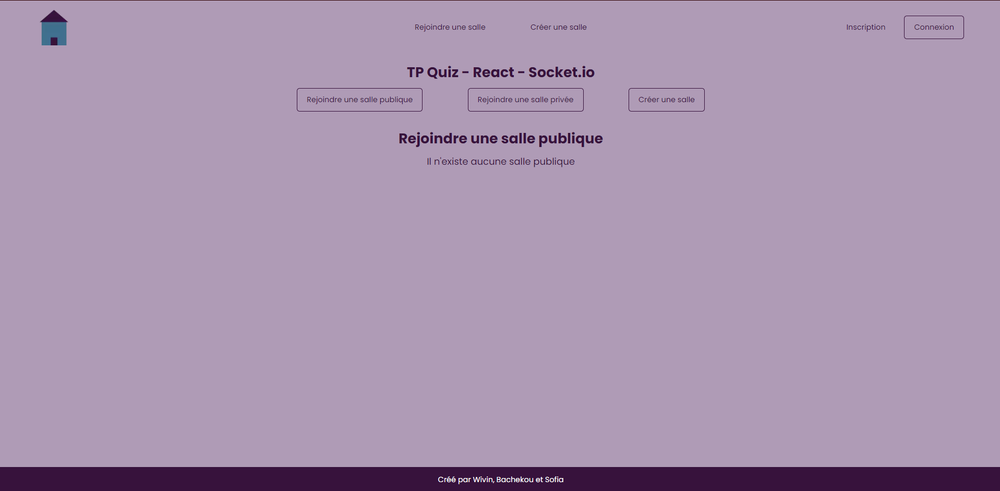

# React Quizz

## Membres du projet 

* KHALDI Sofia
* STRUYS Wyvin
* DIABY Bachekou

## Instructions de lancement

Il faut executer la commande suivante : 
***docker compose up -d***

## Variables d'environnement attendues

**Partie Front** : Clé NEXTAUTH_SECRET  

**Partie back** : Clé CHATGPT

## Répartition des taches

* Sofia : Mise en place du projet de base et du Trello. Implémentation de toute la partie front en statique, du socket.io et gestion des parties (créer des parties publiques et privées, rejoindre des parties, gerer des parties)

* Wyvin : Mise en place du Docker, de Prisma et du système d'authentification

* Diaby : Soutien sur les différentes taches en pair programming et dans la conception : gestion des parties (comment génerer un code pour une salle privée ? Comment differencier une partie publique d'une partie privée), gestion de la synchronisation des joueurs (s'assurer que les joueurs aient les questions et les réponses au bon moment, avoir un timer fonctionnel)

La page d'accueil du projet devrait ressembler à ceci, il se peut qu'elle n'aie pas chargée entièrement après avoir lancé docker-compose up -d, il faudra donc recharger la page

